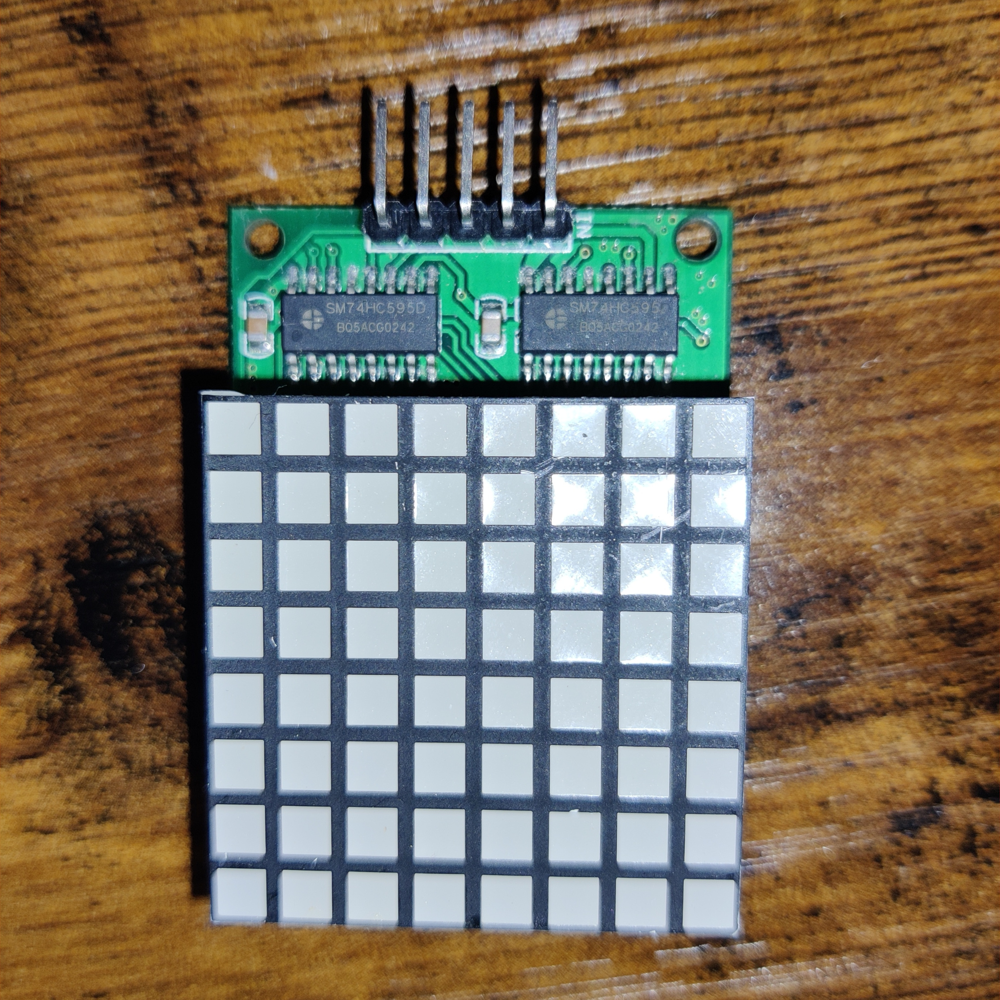
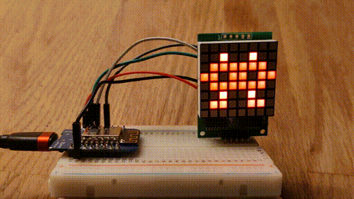

# ControlDM11A88 [](https://registry.platformio.org/libraries/maxchinni/ControlDM11A88)
Simple DM11A88 8x8 led matrix library for ESP8266.

## DM11A88
DM11A88 is a 8×8 square led matrix module which is based on a couple of 74hc595.

<a href="docs/dm11a88-top-view.jpg?raw=1"></a>

## Library
This library can draw whatever you want on the display, but it needs to be constantly refreshed in the `loop()`.

Full example (see [writeM example](examples/writeM/)):

```cpp
#include <ControlDM11A88.h>

// Parameters: DI_PIN, CLK_PIN, LAT_PIN
ControlDM11A88 lc(D7, D8, D5);

uint8_t i;
uint8_t led[] = {
    B10000010, B11000110, B10101010, B10010010, 
    B10000010, B10000010, B10000010, B10000010
};

void setup()
{
}

void loop()
{
    for (i=0; i<8; i++) {
        lc.setRow(i, led[i]);
    }
}
```

The library can help you to draw animations, too (see [sprites](examples/sprites) example)



### Tested on

* Wemos D1 mini

## Resources

* [8x8 ONLINE LED HEX/ BINARY PATTERN GENERATOR FOR ARDUINO](https://www.riyas.org/2013/12/online-led-matrix-font-generator-with.html)
