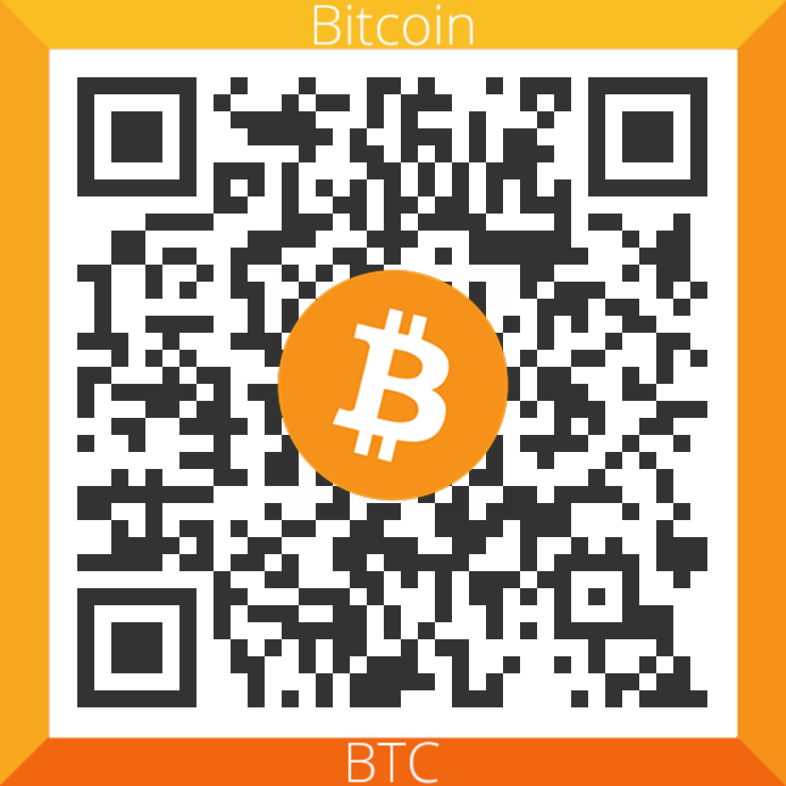

# ControlDM11A88 [](https://registry.platformio.org/libraries/maxchinni/ControlDM11A88)
Simple DM11A88 8x8 led matrix library for ESP8266.

## DM11A88
DM11A88 is a 8×8 square led matrix module which is based on a couple of 74hc595.

<a href="docs/dm11a88-top-view.jpg?raw=1"></a>

## Library
This library can draw whatever you want on the display, but it needs to be constantly refreshed in the `loop()`.

Full example (see [writeM](examples/writeM/) example):

```cpp
#include <ControlDM11A88.h>

// Parameters: DI_PIN, CLK_PIN, LAT_PIN
ControlDM11A88 lc(D7, D8, D5, 1);

uint8_t i;
uint8_t led[] = {
    B10000010, B11000110, B10101010, B10010010,
    B10000010, B10000010, B10000010, B10000010,
};

void setup()
{
}

void loop()
{
    for (i=0; i<8; i++) {
        lc.setRow(0, i, led[i]);
    }
}
```

The library can help you to draw animations, too, see [sprites](examples/sprites) and [counter](examples/counter)
examples.

 

You can daisy chain multiple devices, see [multipleDevices](examples/multipleDevices) example.


### Tested on

* Wemos D1 mini

## Resources

* [8x8 ONLINE LED HEX/ BINARY PATTERN GENERATOR FOR ARDUINO](https://www.riyas.org/2013/12/online-led-matrix-font-generator-with.html)
* [ESP8266: Controlling a LED matrix with the 74HC595 ICs](https://techtutorialsx.com/2016/09/17/esp8266-controlling-a-led-matrix-with-the-74hc595-ics/)
* [Control 8x8 Led Matrix with 2 74HC595](https://forum.arduino.cc/t/control-8x8-led-matrix-with-2-74hc595/556033)
* [Segment LED Display Tutorial for Arduino, ESP8266 and ESP32](https://diyi0t.com/segment-led-display-tutorial-for-arduino-and-esp8266/)

## Donations

<a href="docs/bitcoin-address-qr.png?raw=1"></a>

<a href='https://ko-fi.com/K3K21S534' target='_blank'></a>

<a href="https://www.paypal.com/donate/?hosted_button_id=VNJW6ZLHPM23Q">PayPal</a>
